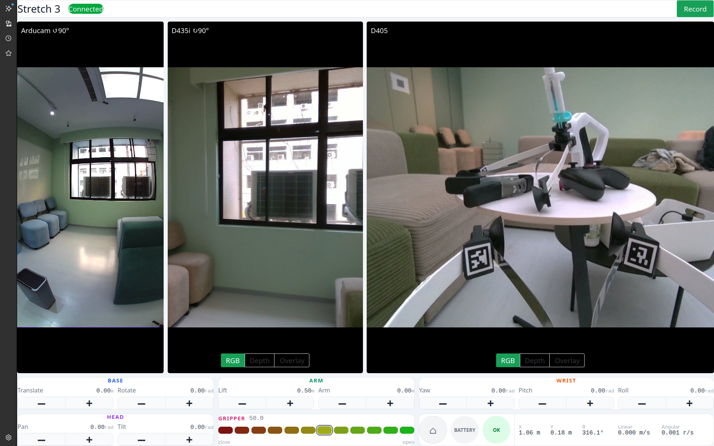

# stretch3-web-teleop

A browser-based teleoperation dashboard for the Stretch 3 robot that streams
live camera feeds, provides joint controls, and supports HDF5 session recording
with MP4 preview export.



## Getting Started

### Prerequisites

- [uv](https://github.com/astral-sh/uv) (Python package manager)
- [pnpm](https://pnpm.io/) (Node package manager)
- [honcho](https://honcho.readthedocs.io/) — install once via
  `uv tool install honcho`

### Run

```bash
honcho start
```

Then open [http://localhost:5173](http://localhost:5173) in your browser.

> Requires [stretch3-zmq](https://github.com/lnfu/stretch3-zmq) running on the
> same host for camera feeds, robot status, and joint control to work.
